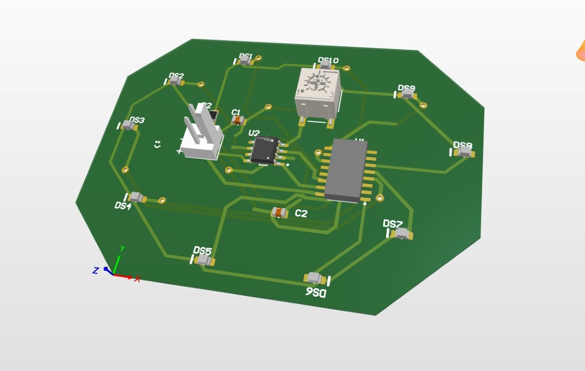
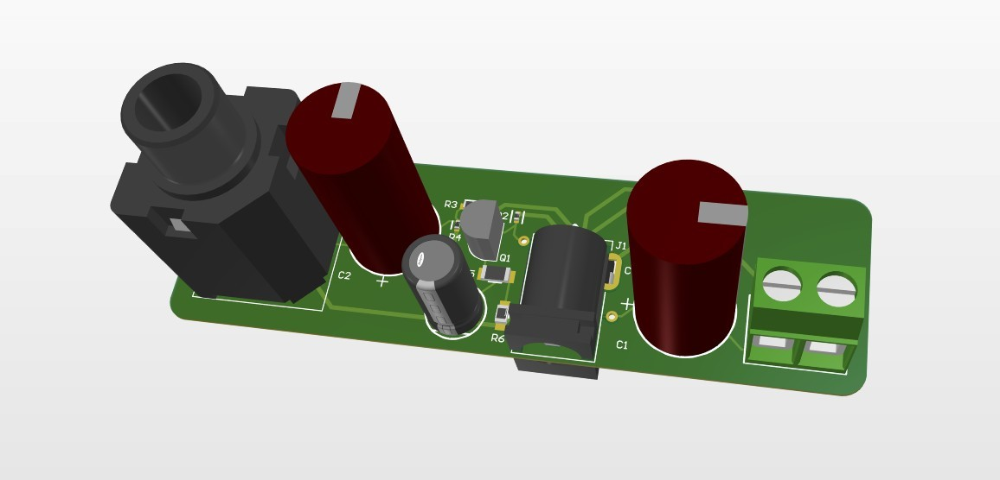

# JT's Corner of the Internet

Hey, I'm Jonathan (also sometimes known as JT). I'm a junior at NYU majoring in Electrical and Computer Engineering. I love playing piano  and music as a whole (I can talk to you about any genre you want), tennis, RPGs and being everyone's favorite twin (sorry Nina).

Right now, I am the High Voltage lead at NYU Motorsports trying to wrap up production on our accumulator to make a fast, efficient and safe car. I also am working on various music technology projects such as custom plugins for local producers and making my own audio hardware. See more projects down below!!

Contact me at jmt10102@nyu.edu. Here is my resume and Github. 

# Projects:

Electro TA

BMS, Fuses, Manufacturing all for motorsports

## PCB Evolution

I started working on my own PCB designs when I was introduced to Altium by my seniors on the High Voltage team. I was inspired by the PreCharge board they were working on and decided I wanted to get good at designing my own boards, so while I was taking Electronics 1 as a sophomore, I made my own design projects to learn alongside the class. The first is a basic LED Chaser PCB. As you can tell it's pretty rough around the edges, but I got a bit better with my next one, a BJT Amplifier. The board looks way nicer now, but it's still a fairly simple circuit. During the summer I decided to challenge myself with an audio electronics project drawing from all the op-amp and circuit knowledge I'd picked up during the semester. That challenge became SoundForge, an FPGA carrier board that lets a keyboard or guitar signal be transformed by any audio effect the user designs on the FPGA.

  <figure style="flex: 1; margin: 0;">
    
    <figcaption>LED Chaser — my first board.</figcaption>
  </figure>
  <figure style="flex: 1; margin: 0;">
    
    <figcaption>BJT Amplifier — cleaner layout.</figcaption>
  </figure>
  <figure style="flex: 1; margin: 0;">
    
    <figcaption>SoundForge — FPGA audio-effects carrier.</figcaption>
  </figure>

The two plugins i currently have made

Sound forge digital aspect stuff

Basic chess project

Automatic umbrella deployer project

Automatic Player Piano project (unfinished)
