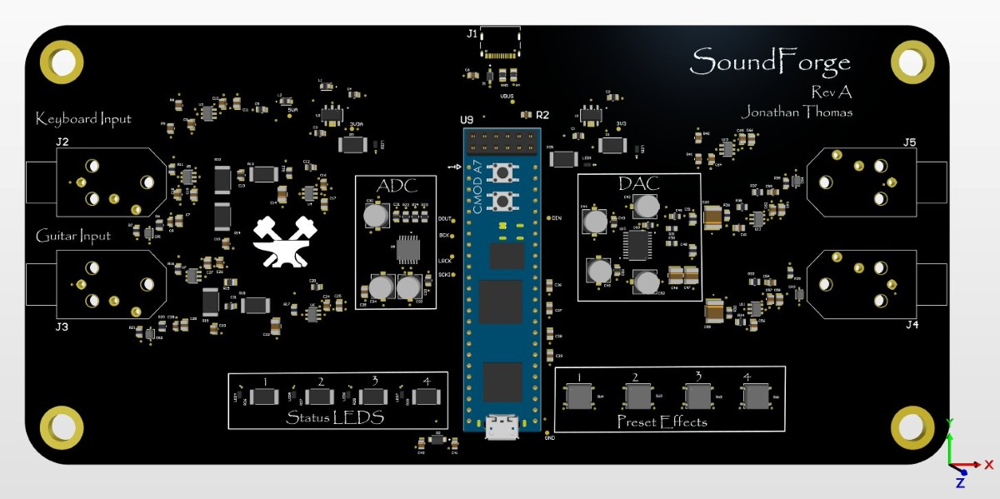

# JT's Corner of the Internet

Hey, I'm Jonathan (also sometimes known as JT). I'm a junior at NYU majoring in Electrical and Computer Engineering. I love playing piano and music as a whole (I can talk to you about any genre you want), tennis, and videogames.

Right now, I am a technical assistant at NYU's MakerSpace and I am the High Voltage lead at NYU Motorsports. I currently in the process of wrapping up production on our accumulator to make a fast, efficient and safe car. I also am working on various music technology projects such as custom plugins for local producers and making my own audio hardware. See more projects down below!!

Contact me at jmt10102@nyu.edu. Here is my resume and Github. 

# Projects:

# Electro TA
This was a fun hackathon project my roomate and I worked on for Gemini's Live Agent Challenge. The task was to built an AI Agent that utilizes multimodal inputs and outputs and one that moves beyond simple text interactions. We designed a live Electrical Engineering Teaching Agent that can help debug hardware in real time. 

Image for Electro TA Here: 

More detailed information when clicking on page: We used an ESP32 devkit microcontroller, alligator clips for reading voltage signals, and an Arducam to send pictures to the agent. To make a conversation seamless, you can't have large pauses between speaking. A hardship we faced early on was latency with the Arducam. We wanted to send pictures of the student’s breadboard circuit to Gemini; not being able to send a photo fast would prolong a response. We had to learn about two different communication protocols that the Arducam deals with simultaneously: I2C and SPI. I2C handles the internal register of the camera and SPI deals with downloading the actual JPEG bytes. Finding balance between increasing the resolution of the pictures we took and being able to transmit that was very difficult. A lot of testing went into just finding that perfect ratio of resolution and baud rate as well as focusing the camera. We also implemented some code to improve the saturation of the image. This step is crucial for getting a comprehensible image to the agent.

We also wanted to be able to send real time information about the circuit to Gemini. Using the ADC pins on the ESP32 we were able to create our own mini “multimeter”. It works by taking the absolute voltage at a node (not the voltage drop) and then scaling it down using a small voltage divider circuit to feed it into the ESP32. We learned about this method the hard way when our first ESP32 got “fried” from reading too high a voltage (5V at the time). We learned that the ESP32 ADC pins can only handle 0-3.3V and so if we wanted to read a 5V signal, we had to scale down the voltage and then later multiply by that same scaling factor in the program to measure the correct voltage. This can be seen in the ESP32 firmware code. This scaling factor is about 2.04, simply just doing basic circuit algebra

To improve our model we added software and hardware safeguards. On the hardware side, we added a Zener diode to act as protection for the board. Basically, if voltage exceeds 3.3V, the Zener diode enters breakdown state and all the excess voltage will be dumped down into ground protecting the circuit. On the firmware side, since ADC readings on ESP32 can be very noisy we incorporated an oversampling technique. In order to get reliable readings to the agent, we rapidly take 20 voltage readings and then average them to calculate a stable number.

There are two scripts that are used with the microcontroller. One is a script written in C++ which tells the microcontroller how to capture pictures and read voltage. This was written in PlatformIO. The second is a Python script which saves the image and given voltage at a time and then sends that information to the live agent.

Click Here to Watch the Demo: https://www.youtube.com/watch?v=KsgKGi3wAVk

## NYU Motorsports
I joined NYU Motorsports the fall semester of my sophomore year. Since then, I've real hands on engineering experience pushing the High Voltage division further to make our team competitive with other universities. 

Images for NYU Motorsports here: 

More Detailed Information when clicking on page: I've also gained much knowledge from senior members on designing, manufacturing and testing over the past year. During my first semester, I was introduced to the topics such as PreCharge, Accumulator safety and integration to the rest of the car. I began modeling our design in CircuitLab to test parameters and also was introduced to Altium where I began researching components for our Contactor Controller PCB. I also lead research on the development of our charging cart as stated per FSAE rules. During my spring Semester As the new High Voltage lead, I strive to make our car safe, efficient and reliable. Throughout the second semester, I did much of the accumulator manufacturing and assembly. As a TA at the MakerSpace, I had special privilege to use our WaterJet which I used to cut out battery cell holders, accumulator case walls, copper busbars, nickel fuses and the top cover of our accumulator. I also used laser cutters to cut out our insulation paper to properly fit the inside walls. I also was the one who developed the BMS firmware for our custom made BMS PCB boards. You can see more on it here: https://github.com/NYU-Formula-SAE-Electronics/BMS-Teensy-Firmware. While our team didn't get to compete in the FSAE New Hampshire event, I spent a lot of time talking to other teams on their strategies and asked around for advice on fixing some small problems with our accumulator. It was a still a greate event where I learned lots. This summer as I begin to take more responsibility, I have been refining my knowledge on all high voltage topics (PreCharge, Accumulator Safety, Fuses, etc...) while designing the new fuses for our cells and doing some testing on our Contactor Controller. 

## PCB Evolution

I started working on my own PCB designs when I was introduced to Altium by my seniors on the High Voltage team. I was inspired by the PreCharge board they were working on and decided I wanted to get good at designing my own boards, so while I was taking Electronics 1 as a sophomore, I made my own design projects to learn alongside the class. 

More detailed information when clicking on page: The first is a basic LED Chaser PCB. As you can tell it's pretty rough around the edges, but I got a bit better with my next one, a BJT Amplifier. The board looks way nicer now, but it's still a fairly simple circuit. During the summer I decided to challenge myself with an audio electronics project drawing from all the op-amp and circuit knowledge I'd picked up during the semester. That challenge became SoundForge, an FPGA carrier board that lets a keyboard or guitar signal be transformed by any audio effect the user designs on the FPGA.

  <figure style="flex: 1; margin: 0;">
    
    <figcaption>LED Chaser — my first board.</figcaption>
  </figure>
  <figure style="flex: 1; margin: 0;">
    
    <figcaption>BJT Amplifier — cleaner layout.</figcaption>
  </figure>
  <figure style="flex: 1; margin: 0;">
    
    <figcaption>SoundForge — FPGA audio-effects carrier.</figcaption>
  </figure>

# Custom Tape Recorder Plugin
One of my closest high school friends is an insanely talented producer and me and him have had a shared passion for music ever since I met him. I decided I wanted to make him his very own plugin for his DAW (ableton) of a sound effect of his choice. We decided on a custom Tape Recorder Plugin. See more below:

Image for Tape Recorder Plugin Here: 

More detailed information: .... need to work on github post for that vst and write a good summary and read me

# Custom BitCrusher Plugin
I love the sound of videogame music specficially that 8 bit charm you hear in old games or even in games like Undertale and Deltarune (side bar if you want to hear me yap for hours mention either of these games. I will talk about the lore, music and everything in between). So I wanted to do research on how this effect works and then develop my own plugin implementing those algorithms. 

Image for BitCrusher Plugin here: 

More detailed information: BitCrusher is a sound effect made up of two different parts with the purpose of lowering the quality of an audio signal: Bit depth and Sample rate. Bit depth: each slice records a value and the precision of that value is the bit depth. Value is noted in binary.

Sample rate: the number of slices taken of a signal per second. 44.1kHz - 48kHz is pretty common. To record a note properly, we need a sample rate that is at least twice as fast as the frequency of the note. (Nyquist limit). This gives us the two peaks of the waveform and its frequency. 

BitCrusher will allow reduction of the bit depth: changes up the waveform by adding harmonics and it also reduces the dynamic range. The more you lower the bit depth the more the sample looks like a square wave. Can bring up the volume of the noise floor 

BitCrusher also allows for reducing the sample rate (Down Sampling): Higher frequencies will be too large for the sample rate and will be misinterpreted as lower frequencies(known as aliasing). You can use a low pass filter to avoid this issue to get a cleaner distortion

Mix: Dry/Wet effect: Controls volume of two things
Dry is the raw unprocessed audio signal before any effects. Wet is the audio signal after being processed by an effect. The knob controls how much of the effect is applied to the unprocessed sound. However it does not change how the audio is processed in any way. Just determines how much the wet and dry sound is mixed together and outputted in the end. It does not affect other parts of the effect processing. It's really just reducing the volume. As you increase the knob, you will introduce more of the effect while reducing the volume of the unprocessed signal. Not a linear progression. 0 - 50%, keeps the raw “dry” sound the same while increasing the wet sound from 0 - 100% and 50% - 100% keeps the wet sound the same while decreasing the signal of the dry sound from 100% to 0%. 

See the full project here: https://github.com/jothomas10102/bitcrushervst

SoundForge: SoundForge is the big summer project I started working on the summer after my sophomore year. My idea that I had was to build the "One Pedal to Rule Them All". Even though have large pedalboards and loads of sound effects are cool, I was getting irritated at the cost of guitar pedals and also having to deal with all those wires. So I decided to build a digital pedal using a singular FPGA board that can implement all those effects digitally. Click here to check out the respository with more detailed information: https://github.com/jothomas10102/SoundForge

Automatic umbrella deployer project: This was the first semester engineering project I worked on as a freshman at NYU. It an umbrella that deploys when water is detected. Check out the video to see the demo: 

Automatic Player Piano project (unfinished): This is a project that I began in the summer after freshman year. It is still incomplete but something that I plan  to finish before I graduate. 

More detail: One day me and my friends found a piano on the side of the road and I really wanted to bring it home and refurbish it. After like two hours of struggling to lift it into my friends truck, we were finally able to drive it back to my house. I had two phases to this plan. One: sand it and refurbish the wood of the piano. The second phase was building a robotic mechanisms to automate it and have the piano play like a ghost piano. Sanding took way longer than I initially thought it would since it was really my first time doing any sort of woodworking. Here's a video of the process. Because of the lack of time I didn't fully get to finish the project during the summer however I did make decent process on the robotic side. I was able to build a skeleton of the 88 keys using LEDs. with this I was able to build the basic software behind the logic of sending a midi signal to a specific key (represented as an LED). The next steps for this project is to build a proper circuit using solenoids and then build a mechanical housing to support those keys. Take a look at the code below to see the progress I've made so far. 
