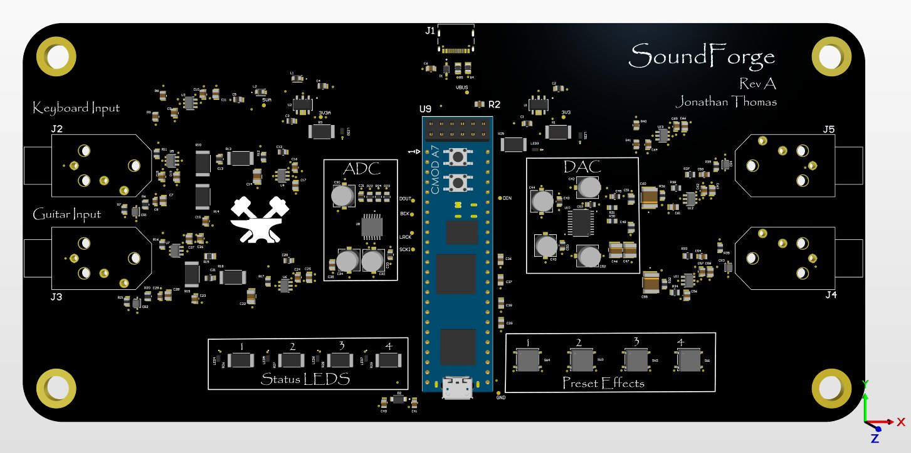

# JT's Corner of the Internet

Hey, I'm Jonathan (also sometimes known as JT). I'm a junior at NYU majoring in Electrical and Computer Engineering. I love playing piano  and music as a whole (I can talk to you about any genre you want), tennis, RPGs and being everyone's favorite twin (sorry Nina).

Right now, I am the High Voltage lead at NYU Motorsports trying to wrap up production on our accumulator to make a fast, efficient and safe car. I also am working on various music technology projects such as custom plugins for local producers and making my own audio hardware. See more projects down below!!

Contact me at jmt10102@nyu.edu. Here is my resume and Github. 

# Projects:

Electro TA

BMS, Fuses, Manufacturing all for motorsports

PCB evolution: I started working on my own PCB designs when I was introduced to Altium by my seniors on the High Voltage team. I was inspired by the PreCharge board they were working on and decided I want to get good a designing my own boards so while I was taking Electronics 1 as a sophomore, I made my own design projects to learn along side the class. The first one is basic LED Chaser PCB. As you can tell its's pretty rough around the edges but I got a bit better with my next one which is a BJT Amplifier. The board looks way nicer now but it still a fairly simple circuit. During the summer I decided I wanted to challenge myself with an awesome audio electronic project drawing from all the op-amp and electronic knowledge I had learned during the semester. That challenge resulted in what I call SoundForge. It's an FPGA carrier board that allows a keyboard or guitar signal to be transformed by any audio effect a user would design on the FPGA. 

The two plugins i currently have made

Sound forge digital aspect stuff

Basic chess project

Automatic umbrella deployer project

Automatic Player Piano project (unfinished)
